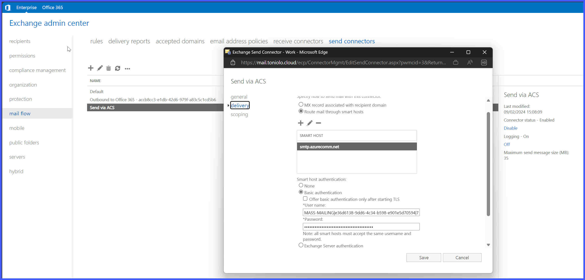
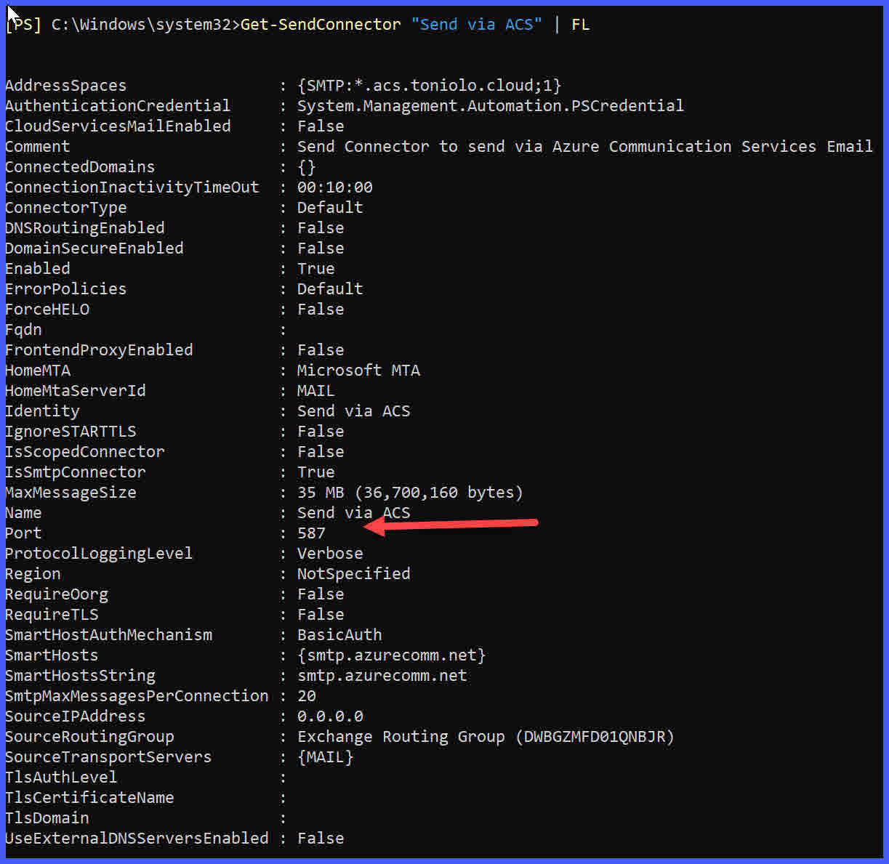

# Transport Agents
### This repository contains a Sample Transport Agent that implement various functions by leveraging Trasnport Agents in Microsoft Exchange 2019 CU12. 

## Features

- AutoResponderAgent: Sends an automatic response to emails directed to a mailbox or address that is being deprecated/removed
- DomainReroutingAgent: Rewrite the routing domain to be a differnt one (can be used to re-route traffic via a specific send connector matching the domain name space)
- HeaderAgent: Insert a custom header with a custom value in the header of every message that traverse the mail server
- NDRAgent: Drops Non-Delivery Report (NDR) that contains in the body the word "DELETE"
- RecipientDomainRewriteAgent: For any message sent to an address whose domain part is "contoso.com", it redirect the message to the same recipient on domain "tailspin.com"
- SenderDomainRewriteAgent: For any message received from an address whose domain part is "contoso.com", it changes the sending domain and make the message appear from "tailspin.com"
- TaggingAgent: Redirect a message to somebody+text@domain to somebody@domain, implementing Plus Addressing

## Installation

Example shows the installation of the agent AutoResponderAgent, the same apply to all other agents in the sample, it's just necessary to select the appropriate agent name form the list above.
It is possible to consecutively install more agents, that will then execute based on priority. Just repeat the steps 3-4 below for each agent you want to install

1.	Copy the DLL to the server (i.e. F:\Transport Agents\\)
2.	Make sure the Exchange acconts have access to the folder
3.	Install the transport agent via 
	- Install-TransportAgent -Name AutoResponderAgent -TransportAgentFactory "TransportAgents.AutoResponderAgent" -AssemblyPath "F:\Transport Agents\TransportAgents.dll"
4.	Enalbe the chosen Transport Agent via 
	- Enable-TransportAgent AutoResponderAgent
5.	Exit from Exchange Management Shell
6.	Restart the MSExchangeTransport service via 
	- Restart-Service MSExchangeTransport

## Removal

Example shows the removal and uninstallation of the agent AutoResponderAgent, the same apply to all other agents in the sample, it's just necessary to select the appropriate agent name form the list at the start of this readme.
It is possible to consecutively remove more agents, just repeat the steps 1-2 below for each agent you want to remove

1.	Disable the chose agent via 
	- Disable-TransportAgent AutoResponderAgent
2.	Remove the agent via 
	- Uninstall-TransportAgent AutoResponderAgent
3.	Exit from Exchange Management Shell
4.	Restart the MSExchangeTransport service via 
	- Restart-Service MSExchangeTransport

## Important note for DomainReroutingAgent

If you plan to use this Transport Agent to re-route part of your mass-mailing traffic to Azure Communication Services, make sure you create a send connector that matches the custom routing domain used and that you have configured ACS accordingly.

1. First thing you have to configure ACS as detailed on https://learn.microsoft.com/en-us/azure/communication-services/quickstarts/email/send-email-smtp/smtp-authentication.
2. Then, you need to create a new Send Connector and set smtp.azurecomm.net and the username/password retrieved at #1 as shown in the following image 
3. Last you need to update the port from 25 to 587, this has to be done via PowerShell as shown on the following image 

In the example the domain used is acs.toniolo.cloud, and there is a a check on the sender matching a pre-defined list of senders (noreply@toniolo.cloud) that need to be re-routed.
This can easily be updated to read from Active Directory (i.e. from the Configuration Partition) the list of sender addresses to re-route.

## Logging information

The sample contains two type of lggers, a text based that uses a hard-coded location ("F:\Transport Agents\<NameOfTheAgent>.log and one that rely on the Event Log.

The preferred approach is to use the Evetn Log loggers, however note that the relevant Event source (matching the name of the Trasnport Agent class) has to be created manually.
To do so, you can execute thw following command in an elevated prompt:
	- New-EventLog -LogName Application -Source DomainReroutingAgent

## Notes
More on Transport Agents can be found on https://learn.microsoft.com/en-us/exchange/mail-flow/transport-agents/transport-agents?view=exchserver-2019
